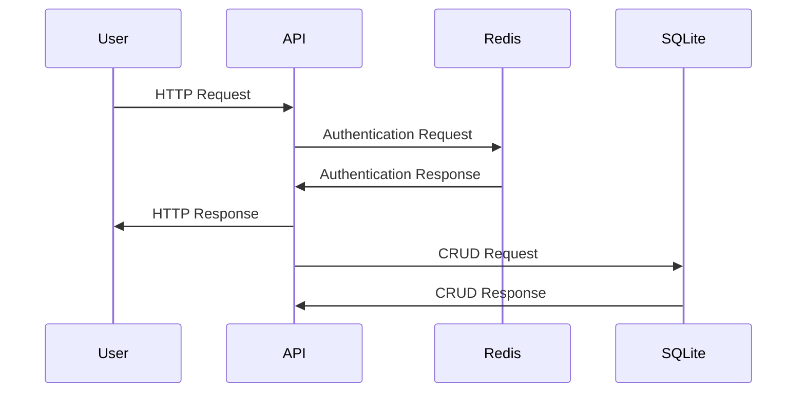

# Rest API
A RESTful API example written in go featuring secure user authentication.
## Architecture Design


## Endpoints
All endpoints begin with the prefix `/api`. 

### Unauthenticated Endpoints
`GET /register`
Returns an API key which can be used for authenticated endpoints.
##### Response
```json
{
    "apikey": "key=="
}
```
### Authenticated Endpoints
Authentication is expected to be an `API key` passed in by the `Authorization` http header.

#### Get a pokemon
`GET /pokemon/{name}`
Get a pokemon via its pokemon name.
##### Response
```json
{
    "Pokedex_Number": 1,
    "Name": "Bulbasaur",
    "Type1": "grass",
    "Type2": "poison",
    "Classification": "Seed Pokémon",
    "Generation": 1,
    "Legendary": false
}
```

#### Delete a pokemon
`DELETE /pokemon/{name}`
DELETE a pokemon via its pokemon name.
##### Response
```json
{
    "message": "Deleted pokemon from database."
}
```